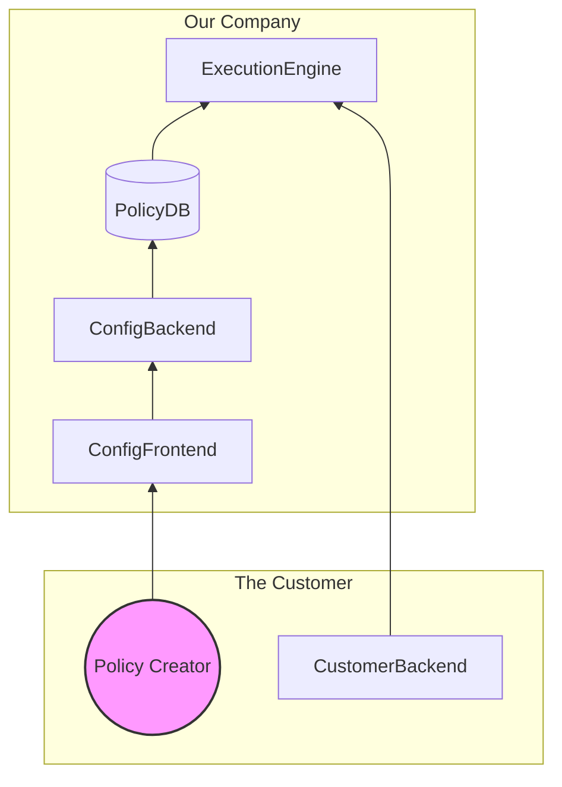

# Vom Take-home Challenge Instructions

Thank you to taking the Vom Take-home challenge! We hope you are able to create
a nice response and learn some valuable things along the way.

To start, read this doc carefully, then clone the repo to your machine and start
coding:

```bash
git clone https://github.com/vomdecision/take-home.git vom-take-home
cd vom-take-home
```

Notice you will code the backend in `backend` dir and the frontend in the
`frontend` dir.

When you are done send the response over email, as instructed on the [How to
Send your Response](#how-to-send-your-response) section.

## Objective

Your goal is to build a decision engine. In other words, software that allows a
non-technical person to design an algorithm (i.e. a decision policy) and put it
into production without the help of a programmer.

## System Description

Here's a high level diagram of the system you must develop:



And here is an explanation:

1. CustomerBackend is a customer system that calls a REST endpoint in our
   ExecutionEngine passing a JSON with whatever fields make sense for that
   decision. The passed fields are the ones which can be used by the policy to
   make a decision. See a simple example with two fields, though your solution
   should accept arbitrary fields:

   ```json
   {
     "age": 23,
     "income": 3000
   }
   ```

   The output of the Execution Engine should be a JSON with a single numeric
   field named `decision`:

   ```json
   {
     "decision": 1000.0
   }
   ```

   For example, in a policy to decide credit limits the output would be a the
   limit, returned in the `decision` field.
2. The policy that will run to make the decision must be read from the PolicyDB
   (Database).
3. The Policy Creator (i.e. a person) uses their browser to access
   ConfigFrontend. The frontend shows a block interface to draw the policy. The
   variables mentioned in the policy design are those that can be sent via REST
   call to the ExecutionEngine. Here is an example policy that computes a credit
   limit, using values of `age` and `income`:

   ```mermaid
   graph TD
      start(START) --> age{Age > 18}
      age --> |no| end1(decision = 0)
      age --> |yes| income{Income > 1000}
      income --> |no| end2(decision = 0)
      income --> |yes| end3(decision = 1000)
   ```

4. ConfigFrontend communicates with ConfigBackend, who stores the policy in the
   PolicyDB.

## Functional Requirements

You must develop 4 components: ConfigFrontend, ConfigBackend, Policy DB and
ExecutionEngine. If you understand that this is an excessive scope for a
challenge, talk to whoever sent it to you to remove ExecutionEngine (frontend
focus) or ConfigFrontend (backend focus) from the scope.

### ConfigFrontend

1. You can use whatever technology you want. Notice that, to make the test a bit
   lighter, we provide a Typescript + React skeleton on the frontend dir you can
   start with or change as you wish. See [frontend/README.md](frontend/README.md)
   for more info.
2. The user can design their policy by placing components on the diagram: a
   START block, one or more conditional blocks and END blocks.
3. The conditional block must have three configurations: the name of the input
   variable that should be checked, the comparison criteria (=, <, <=, >=, or >)
   and the value to compare the variable with.
4. The END block has only one configuration: what numeric value to assign to the
   `decision` field in the output, when that block is reached.
5. For simplicity, it is not necessary to be able to edit different policies. In
   other words, the decision engine can only make one type of decision.

### ConfigBackend

1. Write a REST service that makes it possible to edit and read the decision
   policy, which the user draws in the frontend.
2. You can use whatever technology you want. However, as we use Python in our
   stack, showing mastery of this language is a plus!

### PolicyDB

Use whichever database you prefer. You can even save the policy in a file.

### ExecutionEngine

1. Write a REST API to execute the previously configured policy.
2. You can use whatever technology you want. However, as we use Python in our
   stack, showing mastery of this language is a plus!
3. Modifications made to the policy via the frontend must take effect in the
   ExecutionEngine within a maximum of 10 seconds.

## Non-Functional Requirements

1. Place all components in the same repository, starting from this repo.
2. Write READMEs, all code, comments and UIs in English.
3. Edit the README.md on the repo root justifying your design decisions as well
   as giving instructions on how to run the entire solution, including how to do
   the setup. You can put all information in this file or create additional
   README.md files in the backend and frontend dir as per your preference.
4. Write the cleanest, clearest code you can. Remember someone else will have to
   read and understand.
5. Document the code in such a way that a new person can quickly understand the
   codebase. At Vom we believe good code has comments, which explain the *whys*
   behind the code, but pay attention to not add redundant comments that just
   repeat the *how*.
6. Write backend unit tests.
7. Perform error handling on the backend.
8. On the frontend, show the error messages returned by the backend.
9. Use small commits with good descriptions.

## Non-goals

For simplicity's sake, you don't need to worry about the following aspects:

1. Front-end unit tests.
2. Authentication and Authorization: Leave services completely public.
3. Containerization
4. End to end tests or integration tests.

## Grading Criteria

1. Does the READMEs explain the solution and how to run it?
2. Is it possible to make the solution run quickly with little effort
   configuring the environment?
3. Does the solution demonstrate understanding of the problem or are there
   conceptual errors?
4. Is it possible to design the policy in the frontend?
5. How functional is the UI for policy design?
6. Does the Execution Engine run the policy correctly?
7. Are there serious bugs?
8. Is the code clear and well tested?
9. Are the solution as a whole and its details well documented, including code
   comments?
10. Does the solution meet all non-functional requirements?

## Tips

1. If you deem it necessary, simplify the problem to deliver something. If you
have any doubts about interpreting the requirements, make an assumption on how
to best solve this doubt so that the challenge makes sense and document that in
the README.md.
2. If you find an error in the challenge specification, send an email suggesting
   the correction and consider this suggestion in your implementation.
3. Pay close attention to non-functional requirements and check them all before
   delivering the answer.

## How to Send your Response

1. Remember to commit all your work, in small commits with good descriptions.
2. Create a git bundle file with the repository, including all your commits.

   ```bash
   cd vom-take-home
   git bundle create take-home.bundle --all
   ```

3. Send the bundle over email by replying to the take home invitation email
   message you received.
4. If you want to upload the repo to some public place like GitHub, please
   remove any reference to Vom beforehand (i.e. delete `instructions.md`). We
   want others to work on the challenge from scratch rather than base their
   responses on previous solutions they find on GitHub.

## Good luck!


